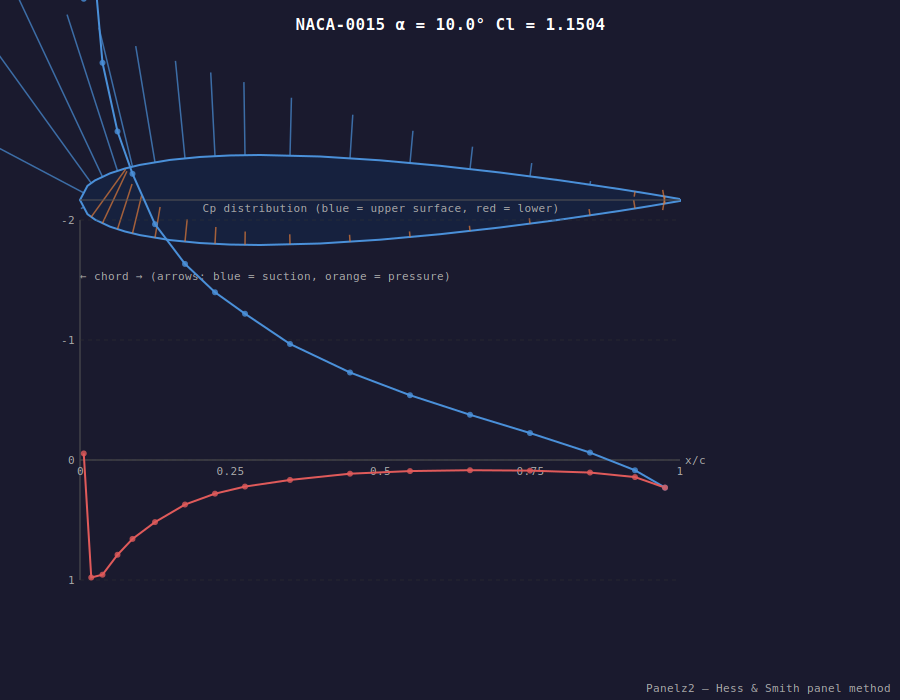
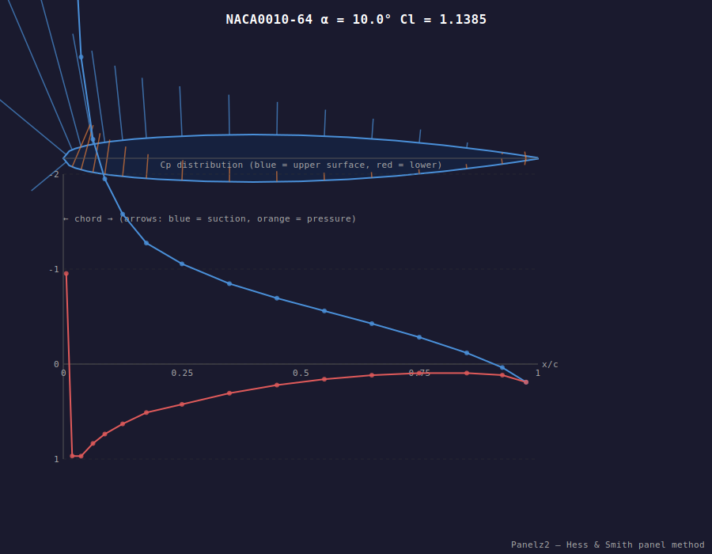
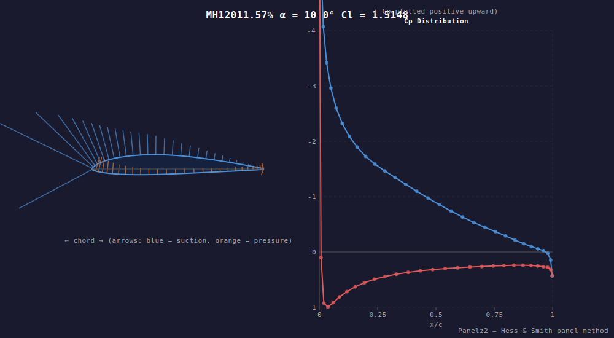

# Panelz2

**Author:** Adam O'Brien  
**E-mail:** obrienadam89@gmail.com  
**Institution:** University of Toronto

A two-dimensional steady source/vortex panel method solver for inviscid flows around airfoils, implementing the classic **Hess & Smith** algorithm. The solver produces surface pressure coefficients (Cp), lift coefficient (Cl), and an SVG visualisation of the results.

Airfoil coordinate files follow the UIUC Airfoil Database format:

> http://m-selig.ae.illinois.edu/ads/coord_database.html

---

## Visualisation Examples

Here are the pressure coefficient ($C_p$) distributions and airfoil pressure envelopes solved at $\alpha = 10^\circ$ (blue represents suction/negative $C_p$, orange/red represents positive pressure):

### NACA 0015 ($C_l = 1.1504$)


### NACA 0010-64 ($C_l = 1.1385$)


### MH 120 Cambered Glider Airfoil ($C_l = 1.5148$)


---

## Algorithm

The solver uses the **constant-strength source + global vortex** formulation:

1. Discretise the airfoil surface into N flat panels.  
2. Build an (N+1)×(N+1) influence-coefficient matrix (Katz & Plotkin §3.14).  
3. Apply no-penetration boundary conditions at each panel control point.  
4. Enforce the **Kutta condition** at the trailing edge.  
5. Solve the linear system with **Eigen's LU factorisation**.  
6. Recover surface tangential velocity, Cp = 1 − (Vt/V∞)², and Cl.  
7. Export results to CSV and a self-contained SVG.

---

## Dependencies

| Library | Purpose | How provided |
|---------|---------|-------------|
| [Eigen 3.4](https://eigen.tuxfamily.org) | Dense linear algebra | CMake `FetchContent` (header-only) |
| [Abseil (absl)](https://abseil.io) | CLI flag parsing | CMake `FetchContent` |
| [GoogleTest 1.14](https://github.com/google/googletest) | Unit & physics tests | CMake `FetchContent` |
| CMake ≥ 3.14 | Build system | System install |
| C++17 compiler | (GCC, Clang, MSVC) | System install |

> **Note:** PETSc, MPI, and Boost are no longer required.

---

## Build

```bash
# Configure (FetchContent downloads Eigen, absl, GTest automatically)
cmake -B build -DCMAKE_BUILD_TYPE=Release

# Build
cmake --build build --parallel

# Run tests
cd build && ctest --output-on-failure
```

The binary is placed in `build/bin/panelz2` (Linux/macOS) or `build/bin/Release/panelz2.exe` (Windows).

---

## Usage

```bash
panelz2 --user_file Files/input.in --airfoil_file Files/naca0015.dat
```

Optional flags:

| Flag | Default | Description |
|------|---------|-------------|
| `--user_file` | *(required)* | Path to the flow-conditions input file |
| `--airfoil_file` | *(required)* | Path to the UIUC-format airfoil coordinate file |
| `--output` | `results` | Base name for output files (`.csv` and `.svg`) |

The solver prints Cl to stdout and writes:
- `<output>.csv` — columns: `x/c, Cp, Vt/Vinf`
- `<output>.svg` — airfoil outline with Cp arrows + Cp vs x/c chart

### Example input file (`Files/input.in`)

```
SourcePanels          = ON
VortexPanels          = ON
FreestreamDensity     = 1.205       # kg/m³
FreestreamVelocityUnits = m/s
FreestreamVelocity    = 100
AngleOfAttackUnits    = degrees
AngleOfAttack         = 10
```

---

## Included airfoils

| File | Description |
|------|-------------|
| `Files/naca0015.dat` | NACA 0015 symmetric airfoil |
| `Files/naca001064.dat` | NACA 001064 |
| `Files/mh120.dat` | MH 120 glider airfoil |

---

## Tests

Tests are written with **GoogleTest** and cover:

- **Vector3D** — arithmetic, magnitude, unit vector, dot/cross product
- **DenseMatrix** — Eigen alias solve correctness (2×2, 3×3, 5×5, identity)
- **Airfoil** — panel length, angle, tangent/normal, chord
- **PanelSolver** — physics validation:
  - Flat plate Cl ≈ 0 at α = 0°
  - Thin airfoil theory: Cl ≈ 2π sin(α) at α = 5° and 10°
  - Symmetric airfoil Cp symmetry at α = 0°
  - Stagnation Cp ≈ 1
  - Suction peak on upper surface at positive AoA

---

## License

See the included `LICENSE` file.
